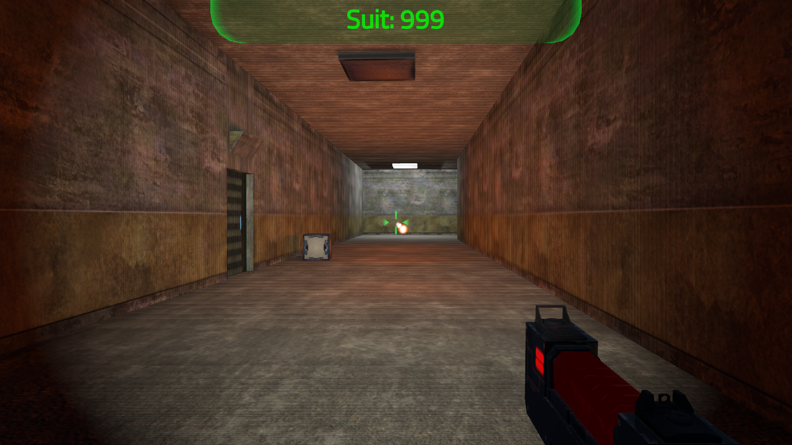

Ejemplo Práctico de FPS para Godot
==================================

Este es un ejemplo de un FPS hecho en forma práctica.
Mirando el código y cómo está hecho te darás cuenta de cómo funciona.

Por ahora está incompleto pero puede servir ya que:
- Corre, apunta, salta y dispara
- Tiene arma con 3 modos de disparo: Metralleta, Escopeta, Bola de energía
- Hay puertas que se abren automáticamente
- Tiene un panel de ingreso de código para abrir la puerta principal
- Y unas torretas te atacarán si el código es incorrecto tres veces

El nivel es generado por un simple código aletoriamente y salva la partida.

El escenario está completo, son simples pasillos con o sin habitaciones y
algunas que otras cajas para ambientizar un poco.
También hay iluminación y el jugador es un modelo 3D completo.

